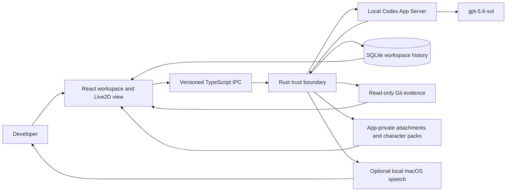

# Coding Wife

> A macOS desktop command center for developers who need to supervise long-running Codex work, review its evidence, and make bounded decisions without reconstructing the story from terminal logs.

| Build Week item              | Verified repository status                                                                                                             |
| ---------------------------- | -------------------------------------------------------------------------------------------------------------------------------------- |
| Recommended track            | **Developer Tools** — the primary user is a developer supervising agentic coding work. Final Devpost track selection is still pending. |
| OpenAI model                 | **`gpt-5.6-sol`**, fixed in both the TypeScript and Rust contracts                                                                     |
| Supported release target     | macOS 14 or later on Apple Silicon                                                                                                     |
| Repository                   | [github.com/aki-0421/coding-wife](https://github.com/aki-0421/coding-wife)                                                             |
| Public demo video            | **Pending** — no YouTube URL is recorded in this repository yet                                                                        |
| Devpost project URL          | **Pending** — submission has not been recorded in this repository yet                                                                  |
| Codex `/feedback` Session ID | **Pending** — it must be copied from the primary Codex thread into Devpost; no placeholder ID is presented as real                     |
| Downloadable release         | **Pending** — the repository provides a reproducible source build, but no public artifact URL is recorded yet                          |

## Problem

Developers supervising an autonomous coding session must correlate chat, tool output, file changes, test results, Git commits, and approval prompts across disconnected surfaces. Long sessions make it difficult to tell what changed, why it changed, whether it was verified, and where human judgment is still required.

## Solution

Coding Wife brings that workflow into one bilingual desktop workspace. A local Codex App Server runs `gpt-5.6-sol`; the app converts its activity into a structured, redacted timeline, persists recoverable workspace context in SQLite, presents bounded decisions, and exposes read-only commit evidence. A Live2D companion communicates status and optional local speech without becoming a source of technical or safety authority.

## What it does

1. Registers a writable Git project and restores its local workspaces, drafts, context versions, and activity.
2. Sends a user instruction, validated project/character context, effort choice, and approved attachment handles to a local authenticated Codex session.
3. Streams normalized plan, assistant, tool, file, test, Git, decision, and completion evidence into the workspace timeline.
4. Lets the user answer explicit decisions, approve or reject a bounded operation, interrupt a turn, and inspect the resulting commit without giving the WebView generic shell or Git authority.
5. Generates a separate, structured commit explanation from redacted evidence and presents captions or opt-in local macOS speech only after an explicit user action.
6. Ships a verified Hiyori Live2D model and supports validated import, preview, selection, and deletion of custom character packs in app-private storage.

## Fastest judging path

### Path A: deterministic interaction demo, no account required

Use this path to evaluate the complete workspace interaction quickly from any development checkout. After dependency installation, the interaction takes about two minutes.

```bash
git clone https://github.com/aki-0421/coding-wife.git
cd coding-wife
corepack enable
pnpm install --frozen-lockfile
pnpm dev
```

Open <http://127.0.0.1:1420/?demoAppServer=1>, then:

1. Keep the preselected workspace and enter `demo:success` in the composer.
2. Select **Send**.
3. When asked how to continue, select **One bounded unit**, then **Send answer**.
4. Select **Approve once** for the simulated focused verification command.
5. Inspect the resulting plan, tool, file, decision, and completion events. Open **Commit**, then **Evidence**, and select **Explain this commit** to inspect the deterministic explanation flow.

This development-only path is intentionally labeled in the UI. It uses in-memory fixtures and does **not** call GPT, read or write Git, use native SQLite, or persist activity after restart. It proves the judge-visible interaction, not the production model integration.

### Path B: production GPT-5.6 Sol path

Use a macOS 14+ Apple Silicon machine with a compatible, authenticated local Codex installation. No application API key or environment variable is required. The native preflight requires a Git repository that is owned by the current user and writable.

Create a disposable judge project so the real model can safely edit and commit:

```bash
JUDGE_REPO_PATH="$(mktemp -d /tmp/coding-wife-judge.XXXXXX)"
git -C "$JUDGE_REPO_PATH" init -b main
printf '# Judge fixture\n' >"$JUDGE_REPO_PATH/README.md"
git -C "$JUDGE_REPO_PATH" add README.md
git -C "$JUDGE_REPO_PATH" \
  -c user.name="Build Week Judge" \
  -c user.email="judge@example.invalid" \
  commit -m "chore: seed judge fixture"
printf '%s\n' "$JUDGE_REPO_PATH"
```

From the Coding Wife checkout, start the native app:

```bash
pnpm tauri:dev
```

Then:

1. Select **Add project** and choose the printed disposable repository path.
2. Use the selected workspace, or select **Add workspace** to create a named session.
3. Send: `Add a Usage section to README.md with one example command, run a relevant verification, and commit the result.`
4. Review every decision before approving it. The disposable repository will contain real model-authored file and Git changes.
5. After completion, inspect **Commit > Evidence** and select **Explain this commit** when explanation evidence is available.

Expected result: the preflight confirms the exact model and capabilities, the activity timeline records normalized evidence, a commit appears in the read-only evidence view, and an explanation is shown only on explicit presentation. If authentication, model availability, repository ownership, or protocol compatibility is missing, the native boundary fails closed and reports a diagnostic instead of substituting demo data.

## Why GPT-5.6 Sol is essential

- **Exact model ID:** `gpt-5.6-sol`
- **Primary job:** understand an open-ended repository request, plan work, use coding tools, edit files, run verification, handle user decisions, and produce a reviewable commit.
- **Secondary job:** explain a completed commit from a separate, bounded, redacted evidence payload with no tools.
- **Why deterministic code is insufficient:** validation and persistence can enforce boundaries, but they cannot replace the repository reasoning and tool use needed to complete an unfamiliar coding task. The browser fixture demonstrates this distinction by reproducing the UI contract without claiming model work.

### Exact production call path

| Stage                     | Code path                                                                                                                                                                                                        | Input, output, and responsibility                                                                                                                                                            |
| ------------------------- | ---------------------------------------------------------------------------------------------------------------------------------------------------------------------------------------------------------------- | -------------------------------------------------------------------------------------------------------------------------------------------------------------------------------------------- |
| Compose                   | [`src/features/workspace-persistence/codex-composition.ts`](src/features/workspace-persistence/codex-composition.ts) and [`turn-context.ts`](src/features/workspace-persistence/turn-context.ts)                 | Combines the authoritative user instruction with a versioned project/character snapshot marked as untrusted quoted context.                                                                  |
| Frontend session boundary | [`src/features/codex/workspace-session-adapter.ts`](src/features/codex/workspace-session-adapter.ts)                                                                                                             | Validates workspace identity, active-turn state, text limits, effort, and attachment handles before emitting typed `codex_turn_start` IPC.                                                   |
| Native supervisor         | [`src-tauri/src/codex/supervisor.rs`](src-tauri/src/codex/supervisor.rs) and [`commands.rs`](src-tauri/src/codex/commands.rs)                                                                                    | Revalidates the request, enforces one active or pending turn, binds workspace/generation/thread identity, probes the authenticated Codex binary, and injects the reviewed commit-work skill. |
| App Server request        | [`src-tauri/src/codex/protocol.rs`](src-tauri/src/codex/protocol.rs) and [`types.rs`](src-tauri/src/codex/types.rs)                                                                                              | Sends `turn/start` with model `gpt-5.6-sol`, effort `low` or `max`, validated attachments, exactly one approved skill, and a structured decision output schema.                              |
| Normalize and retain      | [`src-tauri/src/codex/normalizer.rs`](src-tauri/src/codex/normalizer.rs), [`src-tauri/src/workspace_history/`](src-tauri/src/workspace_history/), and [`src/lib/contracts/codex.ts`](src/lib/contracts/codex.ts) | Converts the App Server stream into versioned semantic events, redacts public text, rejects unsupported protocol shapes, persists durable events, and renders the timeline.                  |
| Explain a commit          | [`src-tauri/src/codex/commit_explanation.rs`](src-tauri/src/codex/commit_explanation.rs), [`support.rs`](src-tauri/src/codex/support.rs), and [`src/features/git-review/`](src/features/git-review/)             | Runs an isolated, zero-tool support turn from bounded `CommitEvidenceV1`; validates structured output and waits for explicit presentation before captions or speech.                         |

### Input

- The user's public instruction, limited to 32,000 Unicode scalar values.
- An immutable turn snapshot containing validated project and character context versions and hashes. The composed request is limited to 80,000 Unicode scalar values and labels context as non-authoritative data.
- Up to ten validated, app-private attachment handles rather than arbitrary WebView file paths.
- **Fast** mapped to reasoning effort `low`, or **Max** mapped to `max`.

### Output

The local Codex App Server returns a tool-using event stream. Coding Wife publishes normalized assistant, plan, tool, file, test, diff, pending-decision, diagnostic, Git, and completion evidence rather than raw protocol messages or private reasoning. The decision and commit-explanation paths use explicit JSON schemas before data reaches the UI.

### Validation and guardrails

- TypeScript and Rust both pin and verify `gpt-5.6-sol`; native preflight checks the authenticated binary, model availability, experimental API compatibility, and supported effort levels.
- Both sides enforce schema versions, scalar limits, control-character rules, workspace/generation/thread identity, attachment constraints, and a single active turn.
- The Rust normalizer redacts public fields, bounds output, and fails closed on unknown or unsafe protocol requests.
- Technical and safety policy cannot be supplied by character context; the bundled commit-work skill is resolved from reviewed application resources.
- Commit explanation uses a separate zero-tool support runtime, redacted evidence, structured output, sequence checks, and an explicit presentation gate before captioning or optional speech.

### Verified Codex compatibility

The release-approved support runtime identity is `codex-cli 0.144.5` for Apple Silicon, executable SHA-256 `5e29ab10ca1171be158f7335dd6bd8ce1aaf9af1556939db36a5ee338be6f5f2`, with canonical generated-schema fingerprint `efea5c6649ccbae7e26af47874bca302e0803d6db80571d57cd55841890dddbc`. The native support gate compares that exact identity and the isolation capability without exposing the executable path.

Any other support binary, version, executable hash, schema fingerprint, or failed isolation proof is unapproved. In that state Coding Wife does not enqueue a support job, start a support process, or invoke the support model; it reports support as unavailable and retains the deterministic local commit-evidence fallback. This support gate is separate from main-session readiness, which still fails closed when its own authenticated App Server or model contract is unavailable.

Settings exposes exactly two implemented desired-state controls: **Enable isolated support** and **Commit explainer**. Native mode reads and updates the owner-only, versioned setting through `support_settings_get` and `support_settings_update`; an enabled preference records intent but never overrides release readiness. A disable update is persisted before it blocks new admission, cancels queued and active explanation work, and returns only after support capacity converges to zero. The browser demo keeps this setting in ephemeral memory and never starts a support model.

## How we used Codex to build Coding Wife

Codex coding agents were used throughout the repository workflow to turn written product contracts into the React/Tauri implementation, connect the TypeScript and Rust boundaries, add focused and regression tests, diagnose race and recovery failures, and harden release, privacy, accessibility, and supply-chain behavior. The commit history preserves these implementation and review units.

Humans retained the consequential product and trust decisions:

- Use the authenticated local Codex App Server instead of placing an OpenAI API key in the WebView.
- Keep the WebView behind typed IPC; do not expose generic shell, arbitrary filesystem, or arbitrary Git commands.
- Let the main Codex work unit create commits, while the app-owned Git evidence service remains a read-only observer.
- Separate background commit-explanation generation from explicit caption and speech presentation.
- Treat the Live2D character as presentation and status only, with equivalent HTML text and no authority over policy or verification.
- Use local `/usr/bin/say` speech, disabled by default, instead of a cloud TTS service or stored generated audio.
- Keep the no-credential demo deterministic and visibly non-production.

The primary Codex `/feedback` Session ID required by Devpost has not been recorded in this repository. It must be taken from the actual primary thread and submitted without inventing or substituting an ID.

## Architecture



- [`src/app/`](src/app/) selects native transports in Tauri and explicitly gated demo transports in browser development.
- [`src/features/`](src/features/) owns workspace composition, localized UI, Codex state, Git evidence, narration, and Live2D presentation.
- [`src/lib/contracts/`](src/lib/contracts/) defines exact, versioned payloads shared across the frontend boundaries.
- [`src-tauri/src/`](src-tauri/src/) is the trusted native boundary for the Codex process, SQLite history, bounded Git observation, app-private files, character validation, and local speech.
- [`src-tauri/resources/skills/`](src-tauri/resources/skills/) contains the reviewed skills injected into main and support turns.

SQLite stores normalized workspace metadata, drafts, context snapshots, and semantic events in the macOS application data directory. The primary work remains in the selected Git repository. Imported character packs and attachment snapshots are validated and copied into app-private storage rather than exposed as arbitrary paths to the WebView.

## Built during OpenAI Build Week

The audit boundary is commit `fbd7be97fe3805f916bb2cbe6f78f842caee3630`, the current merge base with `origin/develop`. It separates earlier research/specification assets from this branch's runnable implementation; it is **not** a claim that the baseline commit predates the official submission period.

### At the audit boundary

- Repository and agent configuration, the minimal Build Week README, and written product/research/specification documents existed.
- There was no `package.json`, `src/`, or `src-tauri/` runnable application tree.

### Added after the audit boundary

- The complete React 19, Tauri 2, and Rust desktop application foundation.
- The pinned `gpt-5.6-sol` Codex App Server integration, typed IPC, context composition, attachments, decisions, interruption, normalization, recovery, and bundled skills.
- Durable SQLite workspace history and context editors.
- Read-only Git commit evidence and the isolated commit-explanation/presentation flow.
- The verified built-in Live2D runtime, custom character-pack management, and English/Japanese desktop UI.
- macOS packaging, deterministic demo coverage, unit/integration/security tests, and submission documentation.

Evidence can be inspected without trusting this summary:

```bash
git diff --stat fbd7be97fe3805f916bb2cbe6f78f842caee3630..HEAD
git log --oneline fbd7be97fe3805f916bb2cbe6f78f842caee3630..HEAD
```

The implementation tree used for this README audit was `37b5330cefab76dce3b6332a1ac15acb19fca13e`; the README update itself changes no application code.

## Setup

### Prerequisites

- macOS 14 or later on Apple Silicon for the supported native target.
- Node.js 22.12.0 or later and Corepack.
- pnpm 10.12.2, pinned by `packageManager`.
- rustup; [`rust-toolchain.toml`](rust-toolchain.toml) selects Rust 1.88.0 with Clippy and rustfmt.
- Xcode Command Line Tools for native development. See the release instructions for bundling requirements.
- A compatible authenticated local Codex installation and a current-user-owned, writable Git repository for production turns.

No `.env` values, application API keys, database server, or cloud TTS credentials are required. [`.env.example`](.env.example) documents this intentionally empty configuration boundary.

### Install and run

```bash
corepack enable
pnpm install --frozen-lockfile
pnpm dev
```

`pnpm dev` serves the browser UI. The normal browser URL is a non-interactive reference preview; add `?demoAppServer=1` only for the explicit development demo described above.

Before native development or `pnpm quality:check` on a fresh machine, install the locked Apple Silicon Cargo metadata used by the offline dependency-license gate and native build. Path A does not need this step.

```bash
cargo fetch --locked --manifest-path src-tauri/Cargo.toml --target aarch64-apple-darwin
```

Then run the production native composition with:

```bash
pnpm tauri:dev
```

### Sample data and assets

- Path A uses deterministic, in-memory demo workspaces and event fixtures from the repository. They reset on restart and never represent real model output.
- Path B creates a user-owned temporary Git repository under `/tmp`; it contains no external data and can be discarded after judging.
- The bundled Hiyori character and Cubism runtime have pinned provenance, checksums, and notices. Custom imported packs remain the user's responsibility.

## Testing

The canonical release-candidate validation starts and ends with a clean repository and runs every gate in the reviewed sequence:

```bash
git status --short
pnpm quality:check
git status --short
```

Both `git status --short` commands must print nothing. `pnpm quality:check` refuses a dirty worktree and verifies formatting, the offline locked-dependency license inventory, clean-checkout reproducibility, frontend and Rust quality, documentation, the Tauri bundle, and diff hygiene in a fixed sequence. Individual commands in the testing guide are focused, partial validation only; they do not replace this canonical gate or the pending fresh-profile/second-Mac install smoke.

For a focused diff-hygiene diagnosis, run `pnpm check:diff`; it is only one component of the canonical quality gate above.

See [Testing Coding Wife](docs/testing.md) for command behavior, focused packaging tests, installation, and safe Gatekeeper guidance.

## Build the macOS artifact

```bash
pnpm release:macos
```

The verified output path is:

```text
src-tauri/target/release/bundle/dmg/Coding-Wife.dmg
```

The release workflow applies an ad-hoc integrity seal and verifies every resource, but the application has no Developer ID identity and is not notarized. Build from reviewed source whenever possible. If Gatekeeper blocks a verified local build, follow the bounded System Settings procedure in [the testing guide](docs/testing.md); do not disable Gatekeeper or remove quarantine globally. Developer ID signing, notarization, stapling, Intel/universal packaging, auto-update, a public checksum, and a public artifact URL are not complete and must not be claimed.

## Privacy and security

- No OpenAI credential is stored in the WebView or this application's environment. Production requests use the user's authenticated local Codex installation.
- Production instructions, selected repository context, and approved attachments are sent through Codex/OpenAI as required to perform the task; Coding Wife is not an offline model and does not claim that this content remains on-device.
- SQLite persistence is local to the macOS app-data directory. The UI provides scoped history deletion that does not delete repository files, commits, or branches.
- The frontend receives versioned, normalized, redacted events. The persistence contract excludes raw reasoning, raw secrets, support prompts/responses, and generated audio.
- Git review is read-only and path-bounded. The main Codex session may edit and commit only inside the selected repository under its own reviewed workflow.
- Character context is presentation-only, imported packs are validated and quarantined before selection, and a model never controls technical policy.
- Optional speech uses `/usr/bin/say`, is off by default, requires a visible caption/presentation scope, and stores no generated audio file.

## Third-party services and notices

| Component                         | Purpose                                          | Current notice or terms boundary                                                                    |
| --------------------------------- | ------------------------------------------------ | --------------------------------------------------------------------------------------------------- |
| OpenAI Codex / `gpt-5.6-sol`      | Production coding and bounded commit explanation | Uses the judge's compatible authenticated local Codex configuration; no app API key is bundled      |
| Locked npm and Cargo dependencies | Conservative declared production/native closure  | [Generated inventory and attribution notice](src-tauri/resources/legal/THIRD-PARTY-DEPENDENCIES.md) |
| Live2D Cubism SDK for Web 5-r.5   | Character rendering                              | [Packaged Live2D third-party notice index](src-tauri/resources/legal/THIRD-PARTY-NOTICES.md)        |
| Bundled Hiyori model              | Default companion                                | [Byte-preserved model notice](src-tauri/resources/characters/builtin-hiyori/NOTICE.txt)             |

The generated inventory conservatively covers all 395 packages in the pnpm declared production closure and the 235 effective Cargo normal dependencies reported for `aarch64-apple-darwin`; it is not a claim that every npm package contributed bytes to the final Vite bundle. Generation is offline, resolves every Cargo tree display to one exact metadata package ID, parses license expressions with a strict SPDX grammar, and fails when either lock changes, a committed notice is stale, a Cargo identity is ambiguous, an expression is malformed, or required source, integrity/checksum, license, or attribution metadata is missing, unknown, or forbidden. The existing Live2D and Hiyori terms remain byte-verified and linked from the same packaged index.

A repository-level project `LICENSE` does **not** exist yet. Selecting one is an explicit owner decision and submission blocker, not permission to copy or redistribute the project; the dependency inventory does not license Coding Wife itself.

## Honest limitations

- Only macOS 14+ on Apple Silicon is supported and tested for this release; Windows, Linux, and Intel Mac are not claimed.
- A compatible authenticated local Codex installation is required for real GPT work. The browser demo is deliberately synthetic.
- The current artifact has only an ad-hoc integrity seal, no Developer ID signature or notarization, and no public binary URL or checksum is recorded.
- Workspace history is local; there is no account, cloud sync, remote collaboration, or automatic backup service.
- Locale UI supports English and Japanese, but this README does not claim native preference persistence beyond the behavior verified in the app.
- The project license, external submission URLs, primary Codex Session ID, and independent install evidence remain pending.

## Submission completion checklist

- [x] English judge path, exact model ID, call path, input/output validation, architecture, testing, and Build Week boundary documented.
- [x] Reproducible macOS source build and honest deterministic UI demo documented.
- [x] Locked dependency inventory, attribution notice, and Live2D/Hiyori terms are generated and packaged.
- [ ] Confirm **Developer Tools** as the final Devpost track selection.
- [ ] Add and review a repository-level project license.
- [ ] Record a public, under-three-minute YouTube demo and replace the pending status above.
- [ ] Create the Devpost project and record its public URL.
- [ ] Submit the actual primary Codex `/feedback` Session ID in Devpost.
- [ ] Publish the reviewed DMG and checksum, or clearly instruct judges to build from source.
- [ ] Record a fresh-profile or second-Mac install and first-launch smoke.
