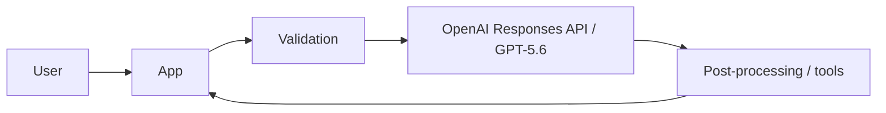

# 提出用ルート README テンプレート

以下をプロジェクトの `README.md` にコピーし、英語で完成させることを推奨します。日本語併記は可能ですが、審査員が英語だけで setup と評価を完了できる状態にしてください。

---

````markdown
# [Project Name]

> [One-sentence tagline: audience + problem + outcome]

**OpenAI Build Week 2026 Track:** [Apps for Your Life / Work and Productivity / Developer Tools / Education]

- **Live demo:** [URL]
- **Demo video:** [Public YouTube URL]
- **Repository:** [URL]
- **Supported platforms:** [Web / macOS / Windows / Linux / iOS / Android / etc.]

## Problem

[Describe one real problem for one specific audience. Explain the current workflow, pain, frequency, and why existing solutions are insufficient.]

## Solution

[Explain the product in 2–4 sentences. State the primary workflow and outcome.]

## What it does

1. [User action]
2. [GPT-5.6-powered processing]
3. [Result and user control]

## Why GPT-5.6 is essential

- **Model:** `[exact model ID, e.g. gpt-5.6 or gpt-5.6-sol]`
- **Where it is used:** [file / service / workflow]
- **What it does:** [reasoning, generation, tool use, classification, transformation, etc.]
- **Why a simpler approach is insufficient:** [specific reason]
- **Validation / guardrails:** [structured output, schema validation, retries, human review, tests]

## How we used Codex

We used Codex through [ChatGPT desktop app / CLI / IDE extension / SDK].

Codex accelerated:

- [Architecture / scaffold]
- [Core implementation]
- [Debugging]
- [Tests / evaluation]
- [Security / accessibility / performance review]

Key decisions made by the team rather than delegated blindly:

- [Decision, alternatives, rationale]
- [Decision, alternatives, rationale]
- [Decision, alternatives, rationale]

The primary Codex thread used for the majority of core functionality is submitted through the Devpost `/feedback` Session ID field.

## Architecture



[Explain components, data flow, persistence, external services, and trust boundaries.]

## Built during OpenAI Build Week

### Before the submission period

- [Pre-existing code / assets / research]

### Added during the submission period

- [New core feature]
- [GPT-5.6 integration]
- [UX / tests / deployment]

Evidence:

- Baseline commit or tag: `[commit / tag]`
- Build Week commit range: `[commit..commit]`
- Development log: `[path]`

## Quick start

### Prerequisites

- [Runtime and version]
- [Package manager]
- [Database / external service]

### 1. Clone

```bash
git clone [repository URL]
cd [repository]
```

### 2. Configure

```bash
cp .env.example .env
```

Required variables:

| Variable | Required | Purpose |
|---|---:|---|
| `OPENAI_API_KEY` | Yes for local API use | Server-side OpenAI API access |
| `OPENAI_MODEL` | No | Defaults to `gpt-5.6` |

Never expose an API key in the browser or commit it to Git.

### 3. Install and run

```bash
[install command]
[development command]
```

Open: [local URL]

## Fastest judging path

1. Open [demo URL].
2. Sign in with:
   - Email: `[judge account]`
   - Password: `[provided securely in Devpost testing instructions]`
3. Select `[sample scenario]`.
4. Click `[primary action]`.
5. Expected result: `[clear result]`.

Estimated time: [under 3 minutes].

## Sample data

- [How to seed / import]
- [Where it comes from]
- [License / permission]

## Testing

```bash
[lint command]
[typecheck command]
[test command]
[build command]
```

Known test scope:

- [Unit]
- [Integration]
- [End-to-end]
- [Model output / evaluation]

## Security and privacy

- API keys are server-side only.
- [Data retention policy]
- [PII handling]
- [Prompt injection / untrusted content handling]
- [Rate limits and abuse controls]

## Third-party services and licenses

| Component | Purpose | License / Terms |
|---|---|---|
| [Library / API / data] | [Purpose] | [License / URL] |

Project license: [LICENSE]

## Limitations

- [Known limitation]
- [Known limitation]
- [What would be done next]

## Team

- [Name — role — contribution]
````

---

## README の審査最適化

- 冒頭30行だけで、問題、価値、track、demo、GPT-5.6 が分かるようにする。
- setup の前に `Fastest judging path` を置く。
- 「Codex を使った」だけでなく、具体的な task と human decision を対比する。
- GPT-5.6 の exact model ID、code path、input/output、validation を書く。
- screenshots、短い GIF、architecture diagram は有効だが、README を重くし過ぎない。
- private credential は README に書かず、Devpost testing instructions に記載する。
- public repo には `LICENSE` と `.env.example` を必ず確認する。
