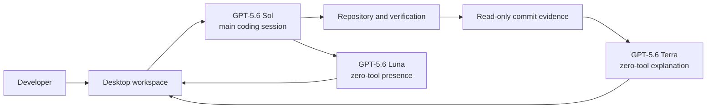

# 提出用root READMEテンプレート

以下の構成を英語で完成させます。角括弧のplaceholderや未解決markerを公開READMEへ残してはいけません。未提供のhosted demo、judge account、screenshotsは無理に作らず、該当するlinkやsectionを省きます。

````markdown
# [Project Name]

> [One sentence: audience + problem + outcome]

**OpenAI Build Week 2026 Track:** Developer Tools

- **Demo video:** [final YouTube URL]
- **Current release:** [final release URL]
- **Repository:** https://github.com/aki-0421/coding-wife
- **Supported platforms:** [exact platforms of the current frozen release]

## Problem

[Describe the specific review or workflow problem for developers.]

## Solution

[Explain the complete user journey in two to four sentences.]

## What it does

1. [The developer starts real work.]
2. [The main model performs the bounded coding workflow.]
3. [Support models improve presence and review without gaining write authority.]
4. [The developer inspects the actual commit and decides what to do next.]

## Three-model GPT-5.6 orchestration

| Role | Exact model | Input | Product output | Authority |
|---|---|---|---|---|
| Main coding session | `gpt-5.6-sol` | [task and approved repository context] | [plan, tools, edits, verification, commit] | [bounded write authority] |
| Presence director | `gpt-5.6-luna` | [bounded sanitized completed-message excerpt] | [caption, expression/motion cue, optional speech] | [zero tools] |
| Commit explainer | `gpt-5.6-terra` | [bounded read-only Git evidence after user request] | [concise explanation] | [zero tools] |

Explain why each role is necessary, how its schema is validated, and how unsupported or unsafe output fails closed. Do not present three model names without their distinct contribution.

## How we used Codex

We used Codex through [official interface or interfaces].

Codex accelerated:

- [architecture and contracts]
- [core implementation]
- [debugging a concrete failure]
- [focused tests and real-app QA]

Humans retained these decisions:

- [authority boundary and rejected alternative]
- [privacy or review trade-off]
- [product and interaction decision]

The representative primary-thread Session ID is provided in the Devpost submission. Do not publish private session content in the README.

## Fastest judging path

1. Download the **current frozen release** from [release URL].
2. Verify [published checksum or release provenance].
3. Install it using [platform-specific instructions].
4. Add [safe disposable project or sample].
5. Run [one short representative task].
6. Confirm [main result, support reaction, and review result].

Estimated time: under three minutes.

The no-rebuild path must exercise the same features claimed in the video. If an older public release exists, label it as historical rather than sending judges to it.

## Source quick start

### Prerequisites

- [runtime and exact version]
- [package manager]
- [platform build tools]
- [authenticated external runtime, if genuinely required]

```bash
git clone https://github.com/aki-0421/coding-wife.git
cd coding-wife
[install command]
[development command]
```

List only real configuration requirements. Do not claim that an OpenAI API key is required if the main path uses an authenticated local Codex session. If optional TTS uses a key, document it as optional and keep it behind the native/server boundary.

## Architecture



[Explain IPC, persistence, trust boundaries, and error handling in a short paragraph.]

## Review experience

- [How the chat reduces noise without hiding failures]
- [How human decisions and interruption work]
- [How commit/file selection and unified diff work]
- [How the explanation is triggered and bounded]

## Live2D companion

[Explain caption, expression, motion, and optional speech. State that the character has no technical, safety, approval, or Git authority and that equivalent text remains visible.]

## Testing

```bash
[focused test command]
[typecheck command]
[build command]
[canonical release-candidate command, only if documented and actually run]
```

Never report a command as passed unless it was run against the stated commit. Link to the full testing guide for platform-specific or release checks.

## Built during OpenAI Build Week

### Before the submission period

- [Pre-existing code, assets, or research]

### Added during the submission period

- [Current core feature]
- [Model orchestration]
- [Review UX, tests, distribution]

Evidence:

- Baseline commit or tag: `[verified immutable identity]`
- Frozen submission commit: `[final immutable identity]`

## Security and privacy

- [Typed boundary instead of generic shell/filesystem/Git authority]
- [Secret storage and redaction]
- [Untrusted model output validation]
- [Data retention and cleanup]

## Third-party services and licenses

| Component | Purpose | License / terms |
|---|---|---|
| [Component] | [Purpose] | [Repository-relative notice or official URL] |

Project-owned code: [root license]

## Limitations

- [Exact platform, signing, or notarization limitation]
- [External runtime requirement]
- [Unsupported features]

## Team

- [Name — role — contribution]
````

## README acceptance

- 冒頭30行でproblem、solution、Developer Tools、video、current release、repositoryが分かる。
- Sol、Luna、Terraのexact model ID、input、output、authority、essentialityが分かる。
- Codexの具体的な貢献とhuman decisionsを対比している。
- Judgeはcurrent featureをrebuildせず試せる。
- Source setup、testing、supported platforms、limitationsが英語だけで分かる。
- Current chat/Git/Live2D UXと動画の操作名が一致する。
- Older release、古いUI、古いmodel roleをcurrentとして案内していない。
- API key、private credential、personal path、private promptを含まない。
- Placeholder、未解決marker、未実施testの成功claimを含まない。
- Root `LICENSE`、dependency notices、Live2D/Hiyori termsへ到達できる。

## Sources reverified on 2026-07-22 JST

- https://openai.devpost.com/rules
- https://openai.devpost.com/details/faqs
- https://openai.devpost.com/updates/45371-tuesday-last-minute-tips
