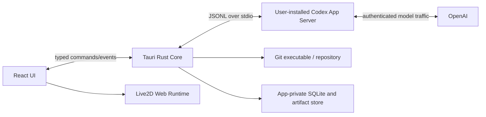

# 03. Codex統合の成立性と推奨アーキテクチャ

## 1. 結論

**確認済み:** Codex App Serverは、独自のリッチクライアントへCodexを組み込むための公式インターフェースであり、認証、履歴、承認、ストリーミングされたエージェントイベントを扱う。既定の`stdio`トランスポートは改行区切りJSONで、双方向の要求・応答・通知を行う。参照: [OAI-01](SOURCES.md#oai-01)

**設計推論:** 本製品は、TauriのRustプロセスからユーザー環境の`codex app-server`を子プロセスとして起動し、React側へ型付きのドメインイベントだけを中継する。CLIの端末UIを埋め込んだり、人間向けの出力を正規表現で解析したりしない。

## 2. 統合方式の比較

| 方式 | 長所 | 短所 | 判断 |
|---|---|---|---|
| CLI端末出力の解析 | 最短で試作可能 | 表示文言に依存、承認や差分の構造が失われる、壊れやすい | 不採用 |
| `codex exec`等の非対話実行 | 自動処理には向く | 継続会話、承認、UI統合、履歴管理が弱い | バッチ用途のみ |
| Codex SDK | 自動化・CIに向く | リッチなローカル対話クライアントにはApp Serverが公式推奨 | 補助用途 |
| Codex App Server | 認証、履歴、承認、イベント、レビューを構造化して扱える | プロトコル互換性管理が必要。一部APIは実験的 | 採用 |

## 3. プロセス境界



### Rust側の責務

- Codex実行ファイルの探索、ユーザー選択、バージョン確認。
- 子プロセスの起動、標準入力・標準出力・標準エラーの分離。
- `initialize` / `initialized`ハンドシェイク。
- JSONメッセージのサイズ上限、スキーマ検証、相関ID管理。
- スレッド、ターン、承認要求、モデル一覧の状態管理。
- 再起動、異常終了、プロセスツリーの終了、アプリ終了時の後始末。
- Reactへ渡す前の正規化、秘匿化、優先度付け。

### React側の責務

- チャット、ストリーミング表示、質問・承認UI。
- 計画、差分、コマンド結果、検証証拠、タイムラインの表示。
- モデル名ではなく、許可された思考レベルの選択。
- Live2Dへの意味的な状態指示。

WebViewへ汎用シェル権限や任意ファイルアクセスを渡さない。参照: [TAU-04](SOURCES.md#tau-04)、[TAU-05](SOURCES.md#tau-05)

## 4. 認証とサブスクリプション

### 4.1 確認済み事項

Codexは次のサインイン方式をサポートする。参照: [OAI-02](SOURCES.md#oai-02)

- ChatGPTサインイン: サブスクリプションアクセス。
- APIキー: 従量課金アクセス。

CLIでは`codex login`によるブラウザフローを利用し、ログイン情報はCodexがローカルファイルまたはOS資格情報ストアにキャッシュする。CLIと他のローカルCodexクライアントはキャッシュされたログインを利用できる。

### 4.2 推奨方針

1. 起動時に`codex login status`またはApp Serverのアカウント状態APIで診断する。
2. 未ログインの場合は、アプリがパスワードやトークンを受け取らず、公式のログインフローへ誘導する。
3. `~/.codex/auth.json`を読み取って独自利用しない。
4. 認証情報をアプリDBへコピーしない。
5. ログアウトやトークン更新はCodexへ委任する。
6. 管理対象ワークスペースのポリシー、モデル可用性、保持設定が適用され得ることを表示する。

### 4.3 音声用APIキーとの分離

音声読み上げを有効にするためのOpenAI APIキーは、Codexのサブスクリプション認証とは別である。

- 既定オフ。
- ユーザーが明示的に設定。
- Rust側の秘密ストアに保存し、WebViewへ平文を返さない。
- 音声送信前に、読み上げ対象をユーザーへ説明する。
- API利用は別課金であることを明示する。
- 特定の音声モデルIDを要件へ固定せず、リリース時点でサポートされるモデルを設定・検証可能にする。参照: [OAI-07](SOURCES.md#oai-07)、[TAU-09](SOURCES.md#tau-09)

## 5. モデル固定と機能検出

### 5.1 メインセッション

- モデルIDは`gpt-5.6-sol`へ固定。
- UIにモデルピッカーを表示しない。
- 思考レベルだけを変更可能にする。
- 利用可能な思考レベルは、ハードコードではなく`model/list`の`supportedReasoningEfforts`から取得する。
- 開始前にモデルが現在のアカウント・ワークスペースで利用可能か検証する。
- 利用不可の場合、別モデルへ自動フォールバックせず開始を止める。

OpenAIのモデルカタログは、Solを複雑な推論とコーディング向け、Terraを性能とコストの均衡、Lunaを高頻度・コスト重視の用途として案内している。参照: [OAI-03](SOURCES.md#oai-03)

### 5.2 サポートセッション

- 許可モデルはGPT-5.6ファミリーのみ。
- `model/list`結果を許可リストと照合する。
- タスク定義が要求するモデルが利用不可なら、同じファミリー内で事前定義した安全な代替を使うか、そのサポート機能だけ停止する。
- メインセッションのモデルを変更しない。
- モデル選択理由とサポート利用量を診断画面で確認可能にする。

### 5.3 思考レベル

メインセッションの思考レベル変更は次のターンから適用する。処理中ターンを暗黙に再実行しない。高い思考レベルは常に良いとは限らず、待ち時間や利用量とのトレードオフを説明する。サポートセッションは役割ごとの既定値を持ち、ユーザー設定で「省利用」「標準」「慎重」などのプロファイルへまとめられる。

## 6. セッション分類

| 種類 | 永続性 | モデル | 目的 | リポジトリアクセス |
|---|---:|---|---|---|
| メインセッション | 永続 | GPT-5.6 Sol固定 | ユーザーとのコーディング対話 | Codexの権限・承認設定に従う |
| 通常サブエージェント | Codex標準 | メインから生成 | 調査・実装等 | Codex標準 |
| サポートセッション | 原則`ephemeral` | GPT-5.6ファミリー | 実況、状態推定、説明、レビュー補助 | 原則なし。秘匿化イベントのみ |
| Detached review | 用途により一時または保存 | GPT-5.6 Sol推奨 | コミット・差分レビュー | 対象差分のみ |

### 6.1 サポートセッションを通常サブエージェントにしない理由

- コーディング作業の指示階層と、UI演出の指示階層を混ぜない。
- メイン会話の履歴や子エージェント一覧を汚さない。
- サポートごとに最小コンテキスト・最小権限・異なるモデルを選べる。
- サポートの失敗がメインターンを失敗させない。
- 実況や表情推定を停止しても、コーディングを継続できる。

### 6.2 `ephemeral`の扱い

App Serverのスレッド型には`ephemeral`があり、永続ロールアウトを持たない一時スレッドとして開始できる。実装時には、現在の対応バージョンで次を自動テストする。

- サポートスレッド開始前後で`CODEX_HOME`のセッションファイルが増えない。
- アプリ終了後にサポートスレッドを再開できない。
- `thread.path`相当が存在しない。
- メインスレッドの履歴にサポート入力が混ざらない。
- クラッシュ時も一時作業ディレクトリとメモリバッファが削除される。

「通常履歴へ残らない」ことと「OpenAIへ送信されない」ことは異なる。モデル実行に必要な入力はサービスへ送信され、契約・ワークスペースのデータ処理条件が適用される。

## 7. 起動シーケンス

```text
1. Codex実行ファイルを探索
2. バージョンと署名元/パスを表示して確定
3. codex app-server をstdioで起動
4. initialize を送信
5. initialized を通知
6. アカウント・設定・モデル一覧を取得
7. gpt-5.6-solと対応思考レベルを検証
8. プロジェクト信頼状態、cwd、Git状態を検証
9. メインthread/startまたはthread/resume
10. イベント購読を開始
11. UIを「準備完了」に遷移
```

起動途中のエラーを「接続失敗」にまとめず、未インストール、バージョン不適合、未ログイン、モデル利用不可、設定警告、プロジェクト未信頼、Git不在に分ける。

## 8. App Serverイベントの利用

### 8.1 主要イベント

App Serverは、スレッド、ターン、アイテムのライフサイクルを通知する。確認できる代表例は次の通り。参照: [OAI-01](SOURCES.md#oai-01)

- `thread/started`、`thread/status/changed`。
- `turn/started`、`turn/completed`。
- `turn/plan/updated`。
- `turn/diff/updated`。
- `item/started`、`item/completed`。
- エージェントメッセージの差分。
- 推論要約の差分。
- コマンド実行出力。
- ファイル変更。
- MCP・動的ツール呼び出し。
- コンテキスト圧縮。
- エラーと利用制限。

### 8.2 正本の扱い

- ストリーム中のdeltaは表示のための暫定情報。
- `item/completed`をアイテムの権威ある最終状態として扱う。
- 差分は`turn/diff/updated`とGit実状態を照合する。
- コマンド成功だけで品質成功とみなさず、対象テストと完了条件へ関連付ける。
- raw reasoningが利用可能でも、製品の実況や監査の中心にしない。読みやすい推論要約、計画、ツール結果、判断を使う。

### 8.3 UIドメインイベントへの正規化

```ts
// 概念例。実際のスキーマはRust側でバージョン管理する。
type DomainEvent =
  | { type: 'phase.changed'; phase: Phase; sourceIds: string[] }
  | { type: 'attention.required'; reason: string; severity: Severity }
  | { type: 'decision.requested'; decisionId: string }
  | { type: 'command.finished'; evidenceId: string; exitCode: number | null }
  | { type: 'files.changed'; paths: string[]; diffRef: string }
  | { type: 'verification.finished'; verificationId: string }
  | { type: 'checkpoint.created'; checkpointId: string; commitSha: string }
  | { type: 'support.output'; role: SupportRole; payloadRef: string };
```

ReactとサポートオーケストレーターをApp Serverのワイヤースキーマへ直接依存させない。

## 9. 承認と質問

### 9.1 コマンド・ファイル承認

App Serverはコマンド実行とファイル変更について、クライアントへサーバー要求を送れる。要求にはスレッド・ターン・アイテム識別子が含まれる。UIは、要求を現在の会話へ正しく関連付け、対象コマンド、作業ディレクトリ、理由、ネットワーク先、ファイル範囲を表示する。参照: [OAI-01](SOURCES.md#oai-01)

承認選択肢は、Codexのプロトコル上の意味を保持する。アプリ独自の「許可」ボタンに丸めて、セッション全体許可と一回許可を混同しない。

### 9.2 ユーザー質問

現在のネイティブ機構は`tool/requestUserInput`であり、製品上の呼称とは分離する。この機能は短い1〜3問と自由入力選択肢を扱えるが、実験的である。

推奨する内部ポート:

```ts
interface DecisionPort {
  request(input: DecisionRequest): Promise<DecisionAnswer>;
}
```

実装アダプターの優先順位:

1. App Serverのネイティブ質問要求。
2. App Serverのdynamic toolによるアプリ所有ツール。
3. MCP elicitation。
4. 通常のメインメッセージを検出し、構造化カードへ変換する互換モード。

実験的機能がない場合も、コア体験が完全に停止しないようにする。

## 10. MCPとdynamic toolsの使い分け

### dynamic toolsが向くもの

- このデスクトップアプリだけが所有するUI操作。
- `request_user_decision`。
- `set_character_state`。
- `mark_checkpoint_candidate`。
- `attach_review_note`。

利点は、プロジェクトやユーザーのグローバルMCP設定を汚さず、スレッド開始時に許可されたツールだけを渡せること。ただし実験的である。

### MCPが向くもの

- 他クライアントでも再利用したい標準化されたツール。
- 外部サービスや既存MCPサーバーとの連携。
- 安定したツール境界として別プロセス化したい機能。

### 注意

- Live2Dへ任意パス、任意JavaScript、任意パラメータを書き込めるMCPを公開しない。
- モデルが送るのは意味的な状態IDだけにし、許可された表情・モーションへ決定論的に変換する。
- MCPのOAuth、elicitation、ツール権限はセキュリティ境界として扱う。参照: [SEC-04](SOURCES.md#sec-04)

## 11. プロセススーパーバイザー要件候補

- 許可するCodex実行ファイルパスを記録し、PATH差し替えによる別バイナリ起動を防ぐ。
- 起動コマンドと環境変数を許可リスト化する。
- 必要最小限の環境変数だけ継承し、秘密を不用意に渡さない。
- stdoutはプロトコル専用、stderrは診断専用として扱う。
- 一行・一メッセージ・キューの上限を設ける。
- 不正JSONを無限再試行しない。
- 連続クラッシュ時は指数バックオフし、ユーザーに停止理由を示す。
- アプリ終了、プロジェクト切替、ユーザー停止時に、ターン中断→スレッド解放→子プロセス終了の順で処理する。
- OSごとにプロセスグループ/Job Object等を使い、孤児プロセスを残さない。
- バージョン、初期化能力、実験機能一覧を診断レポートへ保存する。ただしトークンやプロンプトは含めない。

## 12. 互換性戦略

### 安定面

- `initialize`。
- スレッド・ターンの基本ライフサイクル。
- メッセージ、コマンド、ファイル変更、承認、差分、エラー。

### 変動を想定する面

- 実験的質問要求。
- dynamic tools。
- 一部の履歴ページング・ゴール機能。
- モデルカタログの表示名・思考レベル。
- イベントフィールドの追加。

### 対策

1. 最小対応Codexバージョンを定義する。
2. 起動時に能力を検出する。
3. ワイヤースキーマをRustの互換層で吸収する。
4. 不明フィールドは許容し、不明な列挙値は`unknown`へ退避する。
5. 契約テスト用の記録済みイベントフィクスチャを持つ。
6. 最新版だけでなく、最小対応版と次期版でCIを回す。
7. 実験機能を機能フラグで無効化できる。

## 13. 主な失敗モード

| 失敗 | UIの扱い | 回復 |
|---|---|---|
| Codex未インストール | セットアップ診断 | 公式手順へ誘導 |
| 未ログイン | 会話開始を止める | `codex login`フロー |
| Sol利用不可 | 自動代替しない | ワークスペース/プラン確認 |
| 利用制限 | 現在作業と未保存状態を保持 | 再開可能状態へ |
| App Server切断 | UIを読み取り専用化 | 再接続または安全再起動 |
| イベント欠落 | Git・スレッド状態を再同期 | タイムラインへギャップ記録 |
| 実験API不在 | 互換アダプター | 通常チャット質問へフォールバック |
| サポート失敗 | メインを継続 | その役割だけ無効化・再試行 |
| コンテキスト圧縮 | 状態説明を更新 | 重要判断を外部タイムラインから再注入 |

## 14. 要件化前の実証スパイク

1. 三OSでApp Serverをstdio起動し、初期化・モデル一覧・メインターンを通す。
2. 同じCodexログインがアプリから利用できることを確認する。
3. `gpt-5.6-sol`固定と思考レベル変更を検証する。
4. コマンド承認、ファイル承認、質問要求をUIへ往復する。
5. `turn/diff/updated`とGit差分を照合する。
6. 通常サブエージェントのイベントがメインUIで壊れず表示できることを確認する。
7. `ephemeral`サポートスレッドを100回起動し、履歴ファイル非生成・メモリ解放を監査する。
8. App Serverを強制終了し、未完了ターンとUI状態を安全に復旧する。
9. 最小対応版で実験APIを無効化し、フォールバック体験を確認する。
