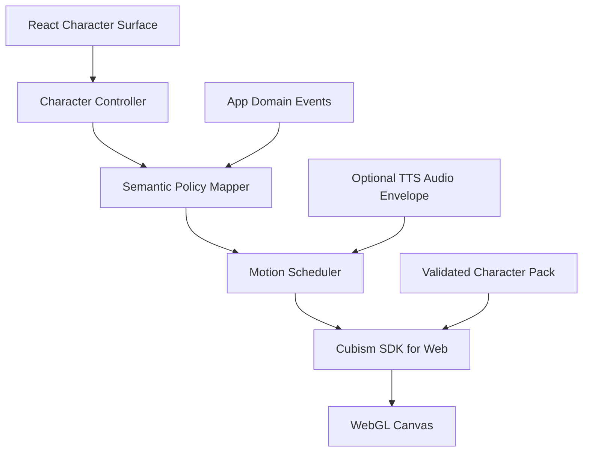

# 05. Live2Dランタイム、資産管理、ライセンス

## 1. 結論

### 技術

**確認済み:** Cubism SDK for WebはTypeScriptとViteを使ったWeb向けサンプルを提供しており、TauriのWebView内でReactと組み合わせる構成は技術的に成立する。公式サンプルはCore、Framework、Resources、TypeScriptの構成を示す。参照: [L2D-03](SOURCES.md#l2d-03)、[L2D-04](SOURCES.md#l2d-04)

### 公開ライセンス

**公開ゲート:** ユーザーが任意数のLive2Dモデルを追加できるアプリは、公式説明上のExpandable Applicationに該当する可能性が高い。すべての公開者に審査と特別な公開ライセンス契約が求められ、承認されない可能性も明記されている。参照: [L2D-01](SOURCES.md#l2d-01)

したがって、設計はユーザーインポートを可能にしつつ、一般配布ビルドではライセンス確認まで機能フラグで無効化できなければならない。同梱キャラクターのクリエイター許諾だけでは、SDK・アプリ公開の許諾を代替しない。この資料は法的助言ではなく、公開前にLive2D Inc.と権利者へ書面確認する。

## 2. 推奨ランタイム構成



### Reactコンポーネント

- Canvasのマウント・アンマウント。
- サイズ、DPI、表示密度、ウィンドウ可視状態の監視。
- キャラクター表示・非表示・縮小ドック。
- ロード状態、エラー、代替表示。
- ポインター入力が必要な場合の明示的なヒット領域。

### Character Controller

- キャラクターパックの読み込み。
- 表情、モーション、視線、呼吸、口形の状態管理。
- 優先度、割り込み、クールダウン、TTL。
- OSのモーション低減設定。
- FPS・GPU負荷に応じた品質低下。

### Semantic Policy Mapper

サポートセッションやメインエージェントから受け取る意味状態を、キャラクターパックが定義した許可済みアクションへ変換する。

## 3. キャラクターアクションのドメインスキーマ

```yaml
character_action:
  id: uuid
  project_id: string
  character_pack_id: string
  semantic_cue: thinking | waiting | uncertain | warning | success | setback | neutral
  channel: expression | motion | gaze | lipsync | attention
  intensity: 0.0..1.0
  priority: 0..100
  interruptible: boolean
  ttl_ms: integer
  cooldown_key: string | null
  source_event_ids: string[]
  source_kind: deterministic | support_model | user
  evidence_level: observed | inferred | decorative
```

モデルが返せるのは`semantic_cue`等の意味層までとする。`motion3.json`のパスや内部パラメータIDを直接指定させない。

## 4. モーションスケジューラ

### 優先度例

1. アクセシビリティ・ユーザー停止。
2. エラー・危険警告。
3. ユーザー入力待ち。
4. 検証結果。
5. 工程遷移。
6. 通常実況。
7. 装飾的な待機。

### 競合ルール

- 高優先度は低優先度を中断できる。
- 警告を喜びモーションが上書きしない。
- 成功モーションはテスト証拠がない場合、弱い肯定表現に制限する。
- 同じモーションを短時間に繰り返さない。
- TTL切れ後はニュートラルへ戻る。
- 古いスナップショット由来のアクションは破棄する。
- ユーザーがレビュー中は大きな動きを抑える。

## 5. 表情・モーション・視線の意味

### 表情

感情名ではなく、状態タグへマッピングする。

```yaml
state_map:
  thinking: expr_focus
  uncertain: expr_question
  warning: expr_concern
  success: expr_relief
  setback: expr_calm_retry
  neutral: expr_default
```

キャラクターごとに存在する表情数は異なるため、必須タグに対するフォールバックチェーンを持つ。

```text
warning → uncertain → neutral
success → neutral
setback → uncertain → neutral
```

### モーション

- `thinking`: 小さな考え込み。
- `waiting`: ユーザーを見る、静かな待機。
- `warning`: 短く注意を向ける。
- `success`: 控えめな肯定。
- `setback`: 落ち着いた再試行。

大きな祝福、落胆、怒りは、実務上の状況を過度に情動化するため既定では避ける。

### 視線

視線は、注目対象を案内する補助に使える。

- 質問時: 意思決定カード方向。
- 差分レビュー開始: 右パネル方向。
- 入力中: ユーザーを凝視し続けない。
- エラー: 警告位置へ短時間。

視線だけで情報を伝えない。

## 6. リップシンクと音声

Live2D SDKは口形パラメータやモーション・表情制御を扱える。実装上は、TTS音声の振幅包絡または音素情報を、キャラクターパックで指定した口形パラメータへ変換する。参照: [L2D-05](SOURCES.md#l2d-05)

### 制約

- 音声がオフでも、字幕と表情で同じ情報が得られる。
- リップシンクのためにマイクを常時取得しない。
- TTSの音声データは再生後に既定で破棄する。
- 声の権利、キャラクターの音声利用許諾を別途確認する。
- AI生成音声であることを明示する。参照: [OAI-07](SOURCES.md#oai-07)

## 7. キャラクターパック仕様案

ユーザーモデルを直接任意パスから毎回読むのではなく、検証済みのアプリ内キャラクターパックへ取り込む。

```text
character-pack/
  manifest.json
  model/
    character.model3.json
    ...referenced assets...
  mapping/
    semantic-map.json
  preview/
    thumbnail.png
  license/
    user-attestation.json
    notices.txt
```

### manifest候補

```yaml
schemaVersion: 1
id: uuid
displayName: string
modelEntry: model/character.model3.json
supportedCues: [neutral, thinking, waiting, uncertain, warning, success, setback]
parameterMap:
  mouthOpen: string | null
  eyeBlinkLeft: string | null
  eyeBlinkRight: string | null
motionPolicy:
  reducedMotionFallback: string | null
license:
  source: bundled | user_import
  redistributionAllowed: boolean
  voiceUseAllowed: boolean | unknown
```

## 8. ユーザーモデルのインポートパイプライン

### 8.1 UX

1. ユーザーが`.model3.json`またはモデルフォルダーを選択。
2. ライセンスと権利について確認・同意。
3. アプリが参照グラフを解析。
4. 安全性・互換性・容量を検証。
5. プレビューを表示。
6. 意味タグと表情・モーションのマッピングを補助。
7. アプリ専用ライブラリへコピー。
8. 元ファイルが移動しても再現できる状態にする。

### 8.2 検証項目

- `.model3.json`のJSON構文と既知スキーマ。
- 参照ファイルが選択ルート内にあること。
- `..`、絶対パス、URLスキームの拒否。
- シンボリックリンク、Windows junction、macOS alias等の実体パス確認。
- ファイル数、合計サイズ、単一ファイル、テクスチャ寸法の上限。
- 許可拡張子の制限。
- 重複・循環参照。
- 必須Core/SDK互換バージョン。
- 表情・モーションの欠落は警告とフォールバック。
- 不正なUnicode名、予約名、長すぎるパス。
- アーカイブを受け付ける場合のZip Slip、展開爆弾、圧縮比上限。

TauriのファイルシステムAPIにもパストラバーサル対策はあるが、インポーター固有の実体パス・リンク・アーカイブ検証を別途行う。参照: [TAU-08](SOURCES.md#tau-08)

### 8.3 禁止事項

- モデル資産内のHTML、JavaScript、実行ファイルをロードする。
- 任意の外部URLからテクスチャやスクリプトを読み込む。
- モデル名をそのままファイルパスに使う。
- インポート資産をクラウドへ自動アップロードする。
- ユーザーの権利確認なしに共有・再配布する。

## 9. CSPと資産配信

TauriはCSPを明示設定し、信頼していないリモートコンテンツを避けることを推奨している。参照: [TAU-07](SOURCES.md#tau-07)

推奨方針:

- UI、SDK、Core、同梱資産をアプリへバンドル。
- 外部CDNスクリプトを使わない。
- キャラクター資産はアプリ専用ディレクトリから、限定したassetプロトコルで提供。
- `img-src`、`connect-src`、`script-src`を必要最小限にする。
- WebAssemblyが実際に必要な場合だけ、Tauriの案内に従い対応CSPを追加。
- キャラクター資産に由来する文字列をHTMLとして挿入しない。
- 外部リンクはWebView内で開かず、確認後にシステムブラウザへ渡す。

## 10. ライセンス調査

### 10.1 SDK公開ライセンス

公式のExpandable Applications説明では、SDKを利用し、ファイルやデータを追加・組み合わせて不定数のモデルを扱う作品は、Expandable Applicationの例に含まれる。すべての公開者について、公開前の審査と特別なPublication License Agreementが必要とされる。また、条件を満たしても承認されない場合がある。参照: [L2D-01](SOURCES.md#l2d-01)

### 10.2 必要な確認

- 本アプリのデスクトップ配布形態がどのプランに該当するか。
- 無料配布・有料配布・将来の収益化ごとの扱い。
- ユーザーが自分のモデルをローカル追加する機能の扱い。
- キャラクターパックの共有機能を将来追加する場合の扱い。
- 同梱モデル数と差し替え可能性。
- 動画配信・スクリーンショット・録画デモにおける表示。
- SDKロゴ、クレジット、EULA記載、報告義務。
- オープンソース化する範囲と、Cubism Core等をリポジトリへ含められるか。

### 10.3 同梱キャラクターの権利チェック

クリエイターから少なくとも次を文書で確認する。

- アプリへのバンドルと再配布。
- Windows、macOS、Linuxでの配布。
- 無償・有償・プロモーション利用。
- 表情、モーション、パラメータのプログラム制御。
- AIの発話主体としての表示。
- TTS音声との同期。
- スクリーンショット、録画、配信、ストア素材。
- 改変、最適化、暗号化、パッキング。
- クレジット表記。
- 契約終了時の既存ユーザーへの扱い。

モデルの著作権、原画、モデリング、衣装、ロゴ、音声は権利者が異なる場合がある。

### 10.4 MVP判断

- 同梱キャラクター: 権利確認とSDK公開条件を満たす場合のみ有効。
- ユーザーインポート: 技術実装は隔離して進めてもよいが、配布版での有効化は書面確認後。
- ライセンス未解決時の代替: 静止画、独自の非Live2D簡易アバター、またはキャラクター非表示でもコア機能が成立する設計。

## 11. パフォーマンスとクロスWebView

Windows、macOS、Linuxで使用するWebView実装が異なるため、WebGLとSDK動作を個別検証する。参照: [TAU-01](SOURCES.md#tau-01)、[TAU-02](SOURCES.md#tau-02)

測定項目:

- 初回ロード時間。
- モデル切替時間。
- アイドル時CPU/GPU使用率。
- アニメーション時CPU/GPU使用率。
- メモリとテクスチャ使用量。
- 高DPI・複数モニター。
- ウィンドウ最小化・復帰。
- スリープ・GPUリセット・WebView再生成。
- Linuxの異なるWebKitGTK/ドライバ。
- リモートデスクトップ環境。

品質段階:

1. Full: 既定FPS、全表情・モーション。
2. Reduced: FPS低下、物理演算・高コスト効果を抑制。
3. Static: 静止ポーズと表情切替のみ。
4. Hidden: キャラクターを非表示、状態テキストのみ。

## 12. アクセシビリティ

- モーション停止ボタンを常時到達可能にする。
- OSの`prefers-reduced-motion`を初期値へ反映する。
- 5秒を超える装飾アニメーションは一時停止・非表示可能にする。
- 点滅を使わない。避けられない場合もWCAGの閾値を超えない。
- キャラクターがフォーカス順へ不要に入らない。
- 重要状態はARIAラベル、テキスト、アイコンでも表す。
- 音声だけで通知しない。
- キャラクターが集中を妨げるユーザーのため、プロジェクト単位・全体の非表示を提供する。参照: [HCI-05](SOURCES.md#hci-05)

## 13. テスト戦略

### 資産テスト

- 公式サンプルモデル。
- 表情なし、モーションなし、物理なし。
- 大量テクスチャ。
- 壊れたJSON、参照欠落。
- パストラバーサル、リンク脱出、Zip Slip。
- 極端なファイル名・Unicode。
- Core/SDK互換性不一致。

### ランタイムテスト

- モーション優先度と割り込み。
- TTL切れ。
- 古いアクション破棄。
- reduced motion。
- 画面リサイズ、最小化、復帰。
- キャラクター切替時のリソース解放。
- WebGL context lostからの回復。
- TTS停止・キャンセルと口形停止。

### UXテスト

- 表情の意味を説明できるか。
- 表情とリスク表示が矛盾した時、証拠を優先できるか。
- キャラクターなしでも全作業を完了できるか。
- 動きがレビューを妨げないか。
- キャラクターの台詞が承認を感情的に誘導していないか。

## 14. 要件定義へ持ち込むべき決定

1. 一般配布前に必要なライセンス承認の責任者と証跡。
2. 同梱モデルの権利チェックリスト。
3. ユーザーインポート機能の公開フラグと地域・版別制御。
4. キャラクターパックの最小スキーマ。
5. 必須の意味タグとフォールバック。
6. モーション低減の既定値。
7. OS別の性能下限。
8. TTSとリップシンクをMVPへ含めるか。
9. エラー時の静止画・非表示フォールバック。
10. 資産の最大容量・テクスチャ寸法・ファイル数。
