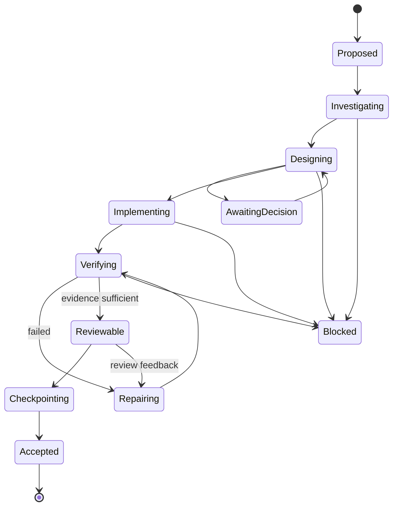

# 07. レビューハーネス、Git、タイムライン、復元

## 1. 結論

品質と速度のトレードオフを崩すには、AIに「最後まで一気に実装してからレビューさせる」のではなく、次を製品レベルで強制・支援する必要がある。

1. 作業を意味のあるレビュー単位へ分割する。
2. 各単位に明示的な完了条件と変更予算を持たせる。
3. 設計判断、試行、失敗、方針変更、検証を追記型タイムラインへ残す。
4. 完了した単位をGitコミットとして固定する。
5. コミットごとにレビュー資料を生成する。
6. 任意時点へ戻る時、コードだけでなく判断と未解決事項も復元する。

Gitコミットは強い復元・比較境界だが、作業過程の全情報を持たない。Git notesはコミットを変更せず補足情報を付けられるが、同期・マージ・書き換え時の扱いが必要である。reflogはローカル参照移動の履歴で、既定の期限切れがあるため製品タイムラインの正本にしない。参照: [GIT-02](SOURCES.md#git-02)、[GIT-03](SOURCES.md#git-03)

## 2. 作業単位（Work Unit）

### 2.1 定義

一つの作業単位は、ユーザーが独立して目的と品質を判断できる最小のまとまりである。

良い例:

- 認証トークン保存層をOS資格情報ストアへ置換する。
- Live2Dの意味状態から表情へのマッパーを実装する。
- App Serverのコマンド承認イベントを構造化UIへ接続する。
- Windows向けプロセス終了処理を追加する。

悪い例:

- 「アプリ全体を完成させる」: 大きすぎる。
- 「変数名を一つ変える」: 通常は細かすぎる。
- 無関係なバグ修正と新機能を同じ単位にする。

### 2.2 Work Unitスキーマ案

```yaml
work_unit:
  id: W-0007
  title: string
  objective: string
  acceptance_criteria: string[]
  in_scope: string[]
  out_of_scope: string[]
  dependencies: string[]
  risk_level: low | medium | high | critical
  review_budget:
    max_files: integer
    max_changed_lines: integer
    max_modules: integer
  required_verification: string[]
  status: proposed | active | blocked | reviewable | accepted | rejected | superseded
```

レビュー予算を超えた場合、ハーネスは自動コミットへ進まず、単位分割または例外判断を要求する。

## 3. 状態機械



すべての作業が全状態を通る必要はないが、少なくとも目的、変更、検証、チェックポイントの対応を残す。

## 4. 変更所有権と汚れた作業ツリー

自動コミットで最も危険なのは、ユーザーや別ツールの既存変更をAIの成果に混ぜることである。

### 4.1 セッション開始時ベースライン

- `HEAD`、ブランチ、worktree、submodule状態。
- tracked/untracked/ignoredの状態。
- 未コミット差分のファイル・ハンク指紋。
- 競合、rebase、merge、cherry-pick中か。
- sparse checkout、LFS、サブモジュール等の特殊状態。

### 4.2 原則

1. セッション開始前から存在する変更を自動stage・commitしない。
2. AI変更と既存変更が同一ハンクで重なる場合、コミットを停止する。
3. 未追跡ファイルは、作業単位で新規作成した証拠がある場合だけ候補にする。
4. 生成物、秘密、巨大バイナリ、`.env`等は除外規則へ従う。
5. `git add -A`のような全件stageを既定にしない。
6. コミット直前に、候補差分と実Git状態を再照合する。
7. ユーザーがアプリ外で変更した場合、所有権を再評価する。

### 4.3 実装方式候補

#### A. 現在の作業ツリーでハンク所有権を追跡

長所: 既存ワークフローを壊しにくい。短所: 同一ファイル編集の競合が難しい。

#### B. Git worktreeで作業空間を分離

Gitは一つのリポジトリに複数の作業ツリーを持てる。独立ブランチでの並行作業に向くが、共有する`.git`データ、サブモジュール、巨大リポジトリ、ツール設定、ポート競合などの運用が必要である。セキュリティサンドボックスではない。参照: [GIT-01](SOURCES.md#git-01)

#### 推奨

- MVPは一つの明示的な作業空間で、開始時にクリーンまたは安全に識別可能な変更のみ許可。
- 並行作業を価値検証へ含める場合は、アプリ管理worktreeを利用。
- 汚れた同一ハンクを安全に分離できない時は、ユーザー判断なしに続行しない。

## 5. チェックポイント生成フロー

```text
1. Work Unitの完了条件を評価
2. 必須テスト・静的解析を実行
3. 変更予算と危険パスを評価
4. Risk Sentinel / reviewerを必要に応じて実行
5. 既存変更との重複を再確認
6. 対象パス・ハンクだけをstage
7. stage後diffを検証
8. コミットメッセージ案を生成・ポリシー検査
9. Git commitを作成
10. commit SHAとtreeを再確認
11. レビュー資料を生成
12. タイムラインへ不可分に関連付け
13. UIへチェックポイント完成を通知
```

Git操作とタイムライン更新は完全な単一トランザクションにはできないため、回復可能な二相処理にする。

- `checkpoint_prepared`
- Git commit
- `checkpoint_committed`
- review pack生成
- `checkpoint_complete`

クラッシュ時はGit実状態から未完了処理を再構築する。

## 6. 自動コミットポリシー

### コミット可能条件

- 作業単位が`reviewable`。
- 必須検証が完了。
- 重大な未解決エラーなし。
- 変更所有権が明確。
- 変更予算内、または明示的例外あり。
- 秘密・巨大ファイル・禁止パスの検査通過。
- merge/rebase等の特殊操作中でない。
- コミット対象が空でない。

### 自動コミットを止める条件

- 既存変更との重複。
- テストを削除・弱化したが理由がない。
- 高リスク領域で必要レビュー未完了。
- 予期しないロックファイル変更。
- 依存関係、データベース移行、公開APIの大幅変更。
- ユーザーが「コミット前レビュー」を設定。
- Git hook失敗。
- commit signingが必須だが利用不能。

### 「コミットボタンなし」と透明性

ユーザー操作としてのコミットボタンは置かなくても、次を表示する。

- コミット予定。
- 対象作業単位。
- 対象ファイル・差分統計。
- 検証状態。
- コミット中。
- 完成したSHA。
- 取り消し・復元方法。

## 7. コミットメッセージ

コミットメッセージはリポジトリ規約を優先する。最低限、目的が分かる件名と、必要な場合の本文を生成する。レビュー資料の全文をコミットメッセージへ詰め込まない。

例:

```text
feat(character): map agent state to allowlisted motions

- add semantic cue policy and cooldown handling
- preserve reduced-motion fallback
- reject unknown asset identifiers
```

AI生成であることの記載、Co-authored-by、署名等はプロジェクトポリシーに従い、勝手に追加しない。

## 8. レビュー資料（Review Pack）

### 8.1 目的

差分を読む前に、ユーザーが「なぜ」「何を」「どこまで検証したか」を理解できるようにする。AIの説明だけでなく、Git・テスト・タイムラインの参照を持つ。

### 8.2 スキーマ案

```yaml
review_pack:
  schema_version: 1
  checkpoint_id: C-0008
  work_unit_id: W-0007
  commit_sha: string
  objective: string
  outcome: completed | partial | blocked
  implementation_summary: string[]
  affected_areas:
    - path: string
      reason: string
      risk: low | medium | high
  decisions:
    - decision_id: string
      summary: string
  attempts:
    - attempt_id: string
      approach: string
      outcome: success | failed | abandoned
      learning: string
  verification:
    - evidence_id: string
      command_or_check: string
      result: passed | failed | skipped | not_applicable
      scope: string
  risks: string[]
  known_issues: string[]
  unverified: string[]
  rollback:
    kind: revert_commit | restore_checkpoint | manual
    instructions: string
  provenance_refs: string[]
```

### 8.3 生成原則

- コミット後の実際の差分から生成する。
- 「テスト済み」を具体的な証拠へ結び付ける。
- 失敗した方法を、役立つ場合だけ簡潔に残す。
- 未検証を隠さない。
- 自動生成文に事実誤認がないか、スキーマ検証と証拠整合を行う。
- 高リスクでは独立レビュー結果も併記する。

## 9. 追記型タイムライン

### 9.1 なぜ別DBが必要か

- Gitはコード状態を保存するが、全イベントを保存しない。
- チャット履歴は長く、因果関係を検索しにくい。
- reflogはローカルで期限切れし得る。
- Git notesは任意に同期されず、書き換え・マージ方針が必要。
- サポートセッションの生履歴をCodexディレクトリへ残さず、必要な派生成果だけ保存したい。

### 9.2 イベントモデル案

```yaml
timeline_event:
  sequence: integer
  id: uuid
  timestamp: timestamp
  project_id: string
  workspace_id: string
  main_thread_id: string | null
  work_unit_id: string | null
  checkpoint_id: string | null
  type: string
  severity: info | attention | warning | error
  actor: user | main_agent | support_agent | policy | git | test_runner | system
  summary: string
  payload_ref: string | null
  source_refs: string[]
  redaction_state: clean | redacted | quarantined
  prev_hash: string
  event_hash: string
```

`prev_hash`は改ざん防止の完全な保証ではないが、欠落や並べ替えの検知に役立つ。必要に応じてチェックポイントごとにハッシュをGit noteやエクスポートへ書き出す。

### 9.3 保存層

- SQLite: メタデータ、関連、検索用フィールド。
- Content-addressed artifact store: 差分、ログ、レビュー資料、検証出力。
- 秘密検査・圧縮・保持期限。
- アプリ専用ディレクトリ。
- プロジェクト削除時の明示的な削除・エクスポート。

## 10. Git notesの位置づけ

Git notesはコミットを変更せず追加情報を付けられ、既定では`refs/notes/commits`へ保存される。参照: [GIT-02](SOURCES.md#git-02)

任意機能として、次の小さな索引を出力できる。

```yaml
checkpoint_id: C-0008
review_pack_digest: sha256:...
review_pack_location: app-local://...
timeline_head: sha256:...
```

ただし、次の理由で正本にしない。

- 通常のpush/fetchに必ず含まれるとは限らない。
- notes refのマージ競合がある。
- commit rewrite時のコピー設定が必要。
- 他ツールが認識しない。
- アプリローカルURIは他環境で解決できない。

チーム共有を将来行う場合は、レビュー資料をリポジトリ内の明示ディレクトリ、PR本文、外部ストレージへエクスポートする別設計が必要である。

## 11. 復元モデル

### 11.1 閲覧

任意チェックポイントを選び、当時のコード、判断、テスト、未解決事項を読み取り専用で表示する。

### 11.2 比較

- 現在との差分。
- 二つのチェックポイント間の差分。
- 当時の決定と現在の決定。
- 検証結果の変化。

### 11.3 復元

復元操作は状況で分ける。

- 公開済み・共有済み履歴: 原則`git revert`で新しいコミットを作る。
- アプリ管理の未共有作業空間: 明示確認の上でbranch/worktreeを当時点から作る。
- 作業途中: 保存済みパッチや一時ブランチから再構築。

`reset --hard`を既定の復元操作にしない。既存作業を失う可能性がある。

### 11.4 決定からの分岐

ユーザーが過去の決定を変える場合:

1. 対象決定を選択。
2. その決定に依存する後続作業を列挙。
3. 新しい作業空間またはブランチを作る。
4. 変更した選択肢を記録。
5. 影響するチェックポイントを再実行・再検証。

コードだけを戻して、決定ログを古いまま残さない。

## 12. 独立レビュー

App Serverの`review/start`は、未コミット変更、ベースブランチ、特定コミット等を対象にレビューできる。detached reviewを使い、実装主体とは別のレビュー文脈を持たせる。参照: [OAI-01](SOURCES.md#oai-01)

### 起動条件

- 高リスク領域。
- 変更予算上限付近。
- 公開API変更。
- データ移行。
- テスト弱化。
- ユーザー指定。
- 重要チェックポイント。

### 結果の扱い

- 指摘を重大度、根拠、対象行、再現性で構造化。
- 実装エージェントへ自動修正を依頼する前に、重大指摘をユーザーへ示す設定を持つ。
- レビューの指摘がすべて正しいとは限らない。採用・却下理由を残す。
- レビュー指摘を大量に並べず、ブロッカー、要確認、提案に分ける。

## 13. 特殊Git状態

要件定義で明示的に扱う必要がある。

- detached HEAD。
- unborn branch。
- merge/rebase/cherry-pick/revert中。
- submodule。
- Git LFS。
- sparse checkout。
- case-insensitive filesystemでの名前衝突。
- symlink。
- worktree locked/prunable。
- commit hooks。
- commit signing。
- shallow clone。
- 大規模モノレポ。
- Windowsの長いパス・予約名。

MVPで未対応の状態は、壊れたまま続けず診断時に明示的に停止する。

## 14. 品質を下げる抜け道への対策

AIが完了条件を満たすために次を行った場合、警告または停止する。

- テスト削除・skip。
- アサーション弱化。
- lint/type checkの除外。
- `any`、型抑制、警告無視の増加。
- 例外握り潰し。
- タイムアウト延長だけで不安定テストを通す。
- セキュリティチェック無効化。
- 生成物を手編集。
- ロックファイルを理由なく大量変更。

決定論的なdiffルールで候補を検出し、必要に応じてRisk Sentinelで文脈評価する。

## 15. 実証テスト

1. 既存変更を含むリポジトリで、AI対象だけを正しくstageできる。
2. 同一ハンク競合時に自動コミットが停止する。
3. コミット直前の外部編集を検出する。
4. Git hook失敗から状態を復旧する。
5. コミット成功後・DB更新前のクラッシュを回復する。
6. DB更新後・レビュー資料生成前のクラッシュを回復する。
7. 100チェックポイント後もタイムライン検索が実用速度。
8. reflog期限やnotes非同期に依存せず復元情報が残る。
9. 過去決定から新しい分岐を作り、依存チェックポイントを特定できる。
10. サポート生履歴なしで、必要なレビュー資料を再表示できる。
