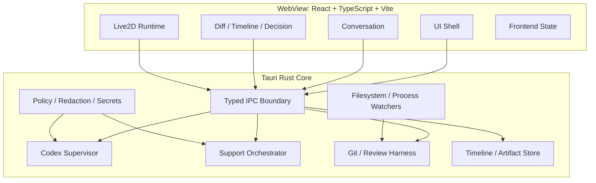

# 08. Tauriクロスプラットフォーム・アーキテクチャ

## 1. 結論

Tauri v2、Rust、React、TypeScript、Viteは本製品の責務分割に適している。TauriはRustプロセスとOS WebViewをメッセージパッシングで接続する。Windows、macOS、Linuxを同一コードベースで扱えるが、WebView、前提SDK、署名、パッケージ形式が異なるため、**単一OSからすべてをクロスコンパイルすることを主戦略にせず、各OSのネイティブCIランナーでビルド・テストする**。参照: [TAU-01](SOURCES.md#tau-01)、[TAU-02](SOURCES.md#tau-02)、[TAU-10](SOURCES.md#tau-10)

## 2. コンポーネント構成



## 3. RustとWebViewの責務境界

### Rust側に置く

- Codex子プロセスとJSONLプロトコル。
- Gitコマンド、差分、stage、commit、worktree。
- ファイル実体パス検証。
- SQLite、アーティファクト、マイグレーション。
- 秘密保管、APIキー、認証状態。
- サポートスケジューリングとレート制限。
- プロンプト・ログの秘匿化。
- 危険操作のポリシー判定。
- アプリ更新、署名検証、診断。
- OS固有のプロセス終了、スリープ抑制、通知。

### WebView側に置く

- 表示状態とユーザー操作。
- チャットストリームのレンダリング。
- 差分・タイムライン・決定カード。
- Live2D Canvasとアニメーション。
- 一時的なUI選択状態。
- アクセシビリティ表現。

### WebView側に置かない

- 任意シェル実行。
- 任意絶対パス読み書き。
- Codex認証トークン。
- 音声APIキー。
- Gitの直接実行。
- 信頼境界を越えるパス正規化。
- 自動コミットの最終判断。

## 4. IPC設計

Tauriのコマンドとイベントを、少数の汎用関数ではなく、目的別の型付きAPIにする。

悪い例:

```ts
invoke('run_shell', { command: userControlledString });
invoke('read_file', { path: arbitraryPath });
```

良い例:

```ts
invoke('project_open', { selectedDirectoryToken });
invoke('main_turn_start', { projectId, text, attachments });
invoke('decision_answer', { decisionId, optionId, freeText });
invoke('checkpoint_review_open', { checkpointId });
invoke('character_pack_import', { pickerGrantId });
```

### 契約原則

- すべての入力をRust側で再検証。
- IDからサーバー側状態を引き、WebView提供パスを信頼しない。
- 列挙型に`unknown`を用意し、互換性を保つ。
- IPCのschema versionを持つ。
- 大量ログや差分をイベントに直接詰めず、ページングまたはartifact IDで取得。
- 秘密やraw promptをレスポンスに含めない。
- エラーはユーザー向けコード、診断ID、再試行可否を分ける。

## 5. 状態管理

### 5.1 正本

- Codexスレッド状態: App Server +アプリの関連メタデータ。
- Git状態: 実リポジトリ。
- 作業タイムライン: SQLite。
- 大きな差分・ログ: content-addressed artifact store。
- UI一時状態: Reactストア。
- キャラクター設定: アプリDBと検証済みパック。

Reactストアを正本にせず、アプリ再起動時にRust側から状態を再構築する。

### 5.2 SQLite候補テーブル

- `projects`
- `workspaces`
- `main_sessions`
- `work_units`
- `decisions`
- `attempts`
- `verification_runs`
- `checkpoints`
- `review_packs`
- `timeline_events`
- `support_runs`
- `character_packs`
- `settings`
- `artifact_index`
- `schema_migrations`

### 5.3 トランザクションと回復

Git、Codex、ファイルシステム、SQLiteは単一トランザクションではない。各外部操作の前後へ意図と結果を記録し、再起動時に整合性修復を行う。

例:

```text
operation_planned → external_action_started → external_action_observed → operation_completed
```

途中状態は「不明」とせず、回復ジョブがGit/プロセス/ファイル実体を検査する。

## 6. Codex子プロセス

### 6.1 ユーザーインストールを使う

Codex CLIをアプリへ無断で同梱・置換せず、ユーザーのインストール済み実行ファイルを利用する。初回に候補パス、バージョン、実行元を表示し、選択を記録する。

### 6.2 起動

RustのプロセスAPIで直接管理する。Tauriのshell/sidecar機構を使う場合も、許可するバイナリと引数を限定する。Tauriのshell pluginは危険なコマンドを既定でブロックし、capabilityによる許可が必要である。参照: [TAU-04](SOURCES.md#tau-04)、[TAU-05](SOURCES.md#tau-05)

### 6.3 環境変数

既定で親プロセス環境を丸ごと引き継がない。Codexに必要な環境と、ユーザーが明示した開発環境変数を区別する。サポートセッションやTTSへ、リポジトリの秘密を含む環境を渡さない。

### 6.4 終了

- ターンを中断。
- 入力ストリームを閉じる。
- 短い猶予後に通常終了。
- 必要ならプロセスツリーを強制終了。
- Windows、Unix系で孤児プロセス検査。
- 次回起動時にPID再利用を誤認しない。

## 7. Git実行

GitもRust側から、固定された引数構造で実行する。シェル文字列連結を避け、引数配列を使う。

- リポジトリルートの実体パスを確定。
- `--`でパス引数境界を付ける。
- ロケール依存の人間向け出力より、機械可読形式を優先。
- 出力サイズと実行時間を制限。
- hookが任意コードを実行し得ることを承認・表示。
- commit signingでユーザー入力が必要な場合の停止・回復を設計。

Gitバイナリの存在・バージョンも事前診断する。

## 8. Tauri capability設計

Tauri v2のcapabilityは、ウィンドウ/WebViewごとの権限を定義する。複数capabilityへ含めると権限が結合され得るため、最小単位に分ける。参照: [TAU-06](SOURCES.md#tau-06)

### 推奨ウィンドウ

MVPでは単一メインウィンドウを基本とし、権限の複雑化を避ける。設定やライセンス表示を別ウィンドウにする場合、それぞれ最小権限にする。

### capability候補

- `core-ui`: 必要最小限のIPC。
- `dialog-project-picker`: ディレクトリ選択のみ。
- `external-link-opener`: 許可スキームと確認付き。
- `updater`: 更新確認と署名済み更新。
- `notifications`: ユーザーが有効化した場合だけ。

WebViewへshell、process、広範なfs権限を直接付けない。

## 9. CSP

TauriはCSPを明示的に設定し、信頼していないリモートコンテンツを避け、許可元を必要最小限にすることを推奨する。参照: [TAU-07](SOURCES.md#tau-07)

### 方針

- `default-src 'self'`を基礎にする。
- 外部スクリプト・CDNを許可しない。
- Live2D資産用の`asset:`/blob等だけを限定許可。
- `connect-src`はTauri IPCと、フロントエンドが本当に直接接続する先だけ。OpenAI通信はRust/Codexプロセス側なのでWebViewから許可しない。
- `script-src`の緩和はSDK要件を検証して最小限にする。
- 開発用CSPと本番CSPを分けるが、本番より無制限にしない。
- インラインHTML挿入を避け、Markdownを安全にレンダリング。
- 外部リンクと画像を自動ロードしない。

## 10. 秘密保管

TauriのStronghold pluginは秘密と鍵の保管機能を提供し、主要デスクトップOSをサポートする。OSネイティブ資格情報ストアを使う方式も比較対象とする。参照: [TAU-09](SOURCES.md#tau-09)

### 保存対象

- 任意のTTS用OpenAI APIキー。
- 将来の外部連携トークン。
- 更新・署名の秘密はユーザーアプリ内ではなくCI秘密管理。

### 保存しない対象

- CodexのChatGPTトークン複製。
- リポジトリ内の秘密。
- サポートプロンプト全文。
- キャラクターパック由来の権利情報以外の個人情報。

秘密を設定画面へ再表示する場合はマスクし、「コピー」も明示操作にする。

## 11. ファイルアクセス

Tauriのfs pluginはベースディレクトリとパストラバーサル対策を提供するが、本製品はさらにRust側でプロジェクトルート・アプリデータルート・インポート一時領域を分離する。参照: [TAU-08](SOURCES.md#tau-08)

### ルート分類

- `ProjectRoot`: Codex/Gitが対象とするユーザープロジェクト。
- `AppDataRoot`: DB、レビュー資料、設定。
- `CharacterLibraryRoot`: 検証済みLive2D資産。
- `ImportQuarantineRoot`: 未信頼インポートの一時領域。
- `TempRoot`: 音声・差分・クラッシュ回復用一時データ。

異なるルート間のコピーは専用コマンドだけで行う。

## 12. OS別の考慮事項

### Windows

- WebView2ランタイム。
- Visual C++ build tools。
- プロセスツリー終了とJob Object相当。
- パス長、予約名、junction、ドライブ文字、UNC。
- SmartScreenとコード署名。
- GPU/WebView2バージョン差。

### macOS

- Xcode/Command Line Tools。
- WKWebView。
- Hardened Runtime、コード署名、公証。
- app sandboxを採用する場合のファイルアクセス設計。
- Apple SiliconとIntelの配布方式。
- symlink、alias、case-sensitive/insensitiveボリューム。

Tauriの公式ガイドは、ブラウザ配布時の警告回避等のためmacOS署名を扱っている。参照: [TAU-11](SOURCES.md#tau-11)

### Linux

- WebKitGTKと各ディストリビューションの依存。
- AppImage、deb、rpm等の選択。
- GPUドライバとWebGL差。
- Wayland/X11。
- キーチェーン実装の差。
- sandbox・ポータル・ファイルピッカー差。

Linuxを「ビルドが通れば対応」とせず、対象ディストリビューションとWebKitGTKバージョンを定義する。

## 13. クロスプラットフォーム・ビルド戦略

### 推奨CIマトリクス

| OS | ビルド | 単体/統合 | Live2Dスモーク | 署名/パッケージ |
|---|---|---|---|---|
| Windows runner | Windows成果物 | 必須 | WebView2実行 | Windows署名 |
| macOS runner | macOS成果物 | 必須 | WKWebView実行 | 署名・公証 |
| Linux runner | Linux成果物 | 必須 | WebKitGTK実行 | 各形式 |

TauriのGitHub Actionsガイドは`tauri-action`によるビルド・リリースと署名設定を説明する。参照: [TAU-10](SOURCES.md#tau-10)

### なぜネイティブビルドか

- OS SDKとWebViewが異なる。
- コード署名・公証がOS固有。
- Live2D/WebGLの実行テストが必要。
- プロセス終了・パス・資格情報ストアがOS固有。
- 単一ホストのクロスコンパイルは構築できても、配布品質の検証を代替しない。

### アーキテクチャ

- Windows x64を最低候補、必要に応じarm64。
- macOS arm64、必要に応じuniversalまたはx64。
- Linux x64を初期候補、arm64は別検証。

対応範囲は利用者仮説とCIコストで決める。

## 14. 署名・更新・供給網

### 署名

- WindowsとmacOSの配布成果物を署名。
- macOSは公証。
- 更新マニフェストと更新物の署名検証。
- 署名鍵を開発端末やリポジトリへ置かない。

### 依存関係

- Rust、npm、Tauri plugin、Live2D SDK/Coreのバージョンを固定。
- lockfileをコミット。
- SBOM生成。
- 脆弱性・ライセンススキャン。
- 再現可能性とビルドprovenanceを段階的に導入。

SLSAは成果物の改ざん防止、完全性、provenanceのための枠組みを提供する。参照: [SEC-05](SOURCES.md#sec-05)

### 更新

- 自動更新は任意設定とし、重要更新を説明。
- 更新前に長時間セッションを安全に停止・保存。
- DBマイグレーションは後方互換とバックアップ。
- Codex CLIの自動更新は本アプリの更新と分離し、ユーザー管理を尊重。

## 15. テスト層

### Rust単体テスト

- プロトコル解析。
- パス検証。
- 変更所有権。
- タイムラインハッシュ。
- 秘匿化。
- スケジューリング。
- キャラクター意味マッピング。

### TypeScript単体テスト

- UI reducer。
- 決定カード。
- イベント順序。
- アクセシビリティ属性。
- 差分・タイムライン表示。

### 契約テスト

- 記録済みApp Server JSONL。
- 最小対応Codex版。
- 実験APIあり/なし。
- 不明フィールド・列挙値。
- 切断・再接続。

### デスクトップ統合テスト

- 子プロセス起動・終了。
- 実Gitリポジトリ。
- SQLiteクラッシュ回復。
- ファイルピッカーとインポート。
- 通知・外部リンク。
- WebViewごとのLive2D。

### E2Eシナリオ

- プロジェクト開始から一つのチェックポイント完成。
- 質問→回答→実装継続。
- テスト失敗→修正→レビュー。
- 既存変更競合。
- App Serverクラッシュ。
- モデル利用不可。
- reduced motion。
- サポート完全オフ。

## 16. パフォーマンス予算候補

数値は実測後に確定するが、対象を先に定義する。

- コールド起動。
- プロジェクト診断時間。
- App Server初期化時間。
- 最初のストリーム表示までの時間。
- 1万件タイムラインの検索・スクロール。
- 大差分のページング。
- Live2Dアイドル時CPU/GPU。
- メモリ上限と長時間リーク。
- 100MB級ログの切り捨て・保管。
- アプリ終了時の子プロセス残存率ゼロ。

## 17. 要件定義前の技術スパイク

1. Tauri最小アプリで三WebView上のLive2Dを動かす。
2. RustからCodex App Serverを起動し、イベントをReactへ流す。
3. 10万イベントのバックプレッシャーと再描画を測る。
4. Windows/macOS/Linuxでプロセス強制終了後に孤児が残らないことを確認。
5. CSPを厳格化したままSDK・資産が動くことを確認。
6. キャラクター資産をasset protocolで安全に配信する。
7. SQLite＋artifact storeのクラッシュ回復。
8. ネイティブCIマトリクスで署名前成果物を生成。
9. 署名・公証の試験パイプライン。
10. アプリ更新とDBマイグレーションのロールバック試験。
